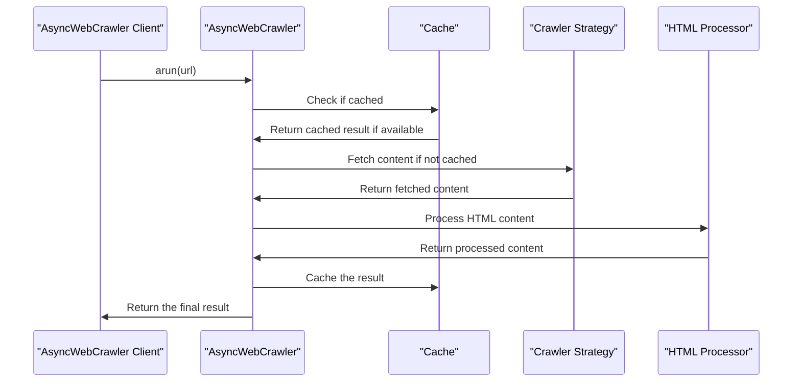

# Chapter 1: AsyncWebCrawler

Welcome to the first chapter of our tutorial on Crawl4AI! In this chapter, we'll explore the `AsyncWebCrawler` class, which is the core component for asynchronous web crawling in Crawl4AI. This class is designed to navigate through the web, fetching and processing content in an efficient and scalable manner.

## What Problem Does AsyncWebCrawler Solve?

Imagine you want to extract information from a website. You need a tool that can fetch the website's content, process it, and provide you with the relevant data. `AsyncWebCrawler` is designed to do exactly that, but with a twist - it is asynchronous, meaning it can handle multiple requests concurrently, making it much faster and more efficient than traditional synchronous crawling methods.

## Understanding AsyncWebCrawler

Let's break down the key components of `AsyncWebCrawler`:

1. **Asynchronous**: `AsyncWebCrawler` is designed to work with asynchronous programming, allowing it to handle multiple tasks simultaneously without blocking. This makes it ideal for applications that require fetching data from multiple sources concurrently.

2. **Web Crawling**: At its core, `AsyncWebCrawler` is a web crawler. It sends HTTP requests to URLs, retrieves the HTML content, and then processes this content to extract relevant information.

3. **Configurable**: The behavior of `AsyncWebCrawler` can be customized using configuration objects. For instance, you can specify how the browser should be configured (e.g., headless mode, user agent) and how the crawling process should be executed (e.g., caching strategy, extraction strategy).

## Using AsyncWebCrawler

To use `AsyncWebCrawler`, you typically follow these steps:

1. Create a `BrowserConfig` object to specify how the browser should be configured.
2. Instantiate `AsyncWebCrawler` with the `BrowserConfig`.
3. Use `AsyncWebCrawler` in an asynchronous context to crawl a URL.

Here's a simple example:

```python
import asyncio
from crawl4ai import AsyncWebCrawler, BrowserConfig

async def main():
    browser_config = BrowserConfig(headless=True)
    async with AsyncWebCrawler(config=browser_config) as crawler:
        result = await crawler.arun(url="https://example.com")
        print(result.markdown)

asyncio.run(main())
```

In this example, we create a `BrowserConfig` with `headless=True`, meaning the browser will run without a visible UI. We then use `AsyncWebCrawler` in an `async with` block to ensure it is properly started and closed. The `arun` method is used to crawl the specified URL, and the result is printed.

## Inside AsyncWebCrawler

Let's dive deeper into how `AsyncWebCrawler` works internally. When you call `arun` on an `AsyncWebCrawler` instance, it performs the following steps:

1. **Check Cache**: It checks if the result for the given URL is already cached. If so, it returns the cached result.

2. **Fetch Content**: If the result is not cached, it uses the configured crawler strategy to fetch the content of the URL.

3. **Process HTML**: After fetching the content, it processes the HTML to extract relevant information based on the configured extraction strategy.

4. **Generate Markdown**: The processed content is then converted into Markdown format.

5. **Cache Result**: Finally, the result is cached for future use if caching is enabled.

Here's a simplified sequence diagram illustrating the process:



## Conclusion

In this chapter, we've introduced `AsyncWebCrawler`, the core class for asynchronous web crawling in Crawl4AI. We've explored its key features, how to use it, and a high-level overview of its internal workings. With this knowledge, you're ready to start using `AsyncWebCrawler` for your web crawling needs.

In the [next chapter](02_crawlerrunconfig.md), we'll dive into `CrawlerRunConfig`, which is used to customize the behavior of `AsyncWebCrawler` during the crawling process.

---

Generated by [AI Codebase Knowledge Builder](https://github.com/The-Pocket/Tutorial-Codebase-Knowledge)