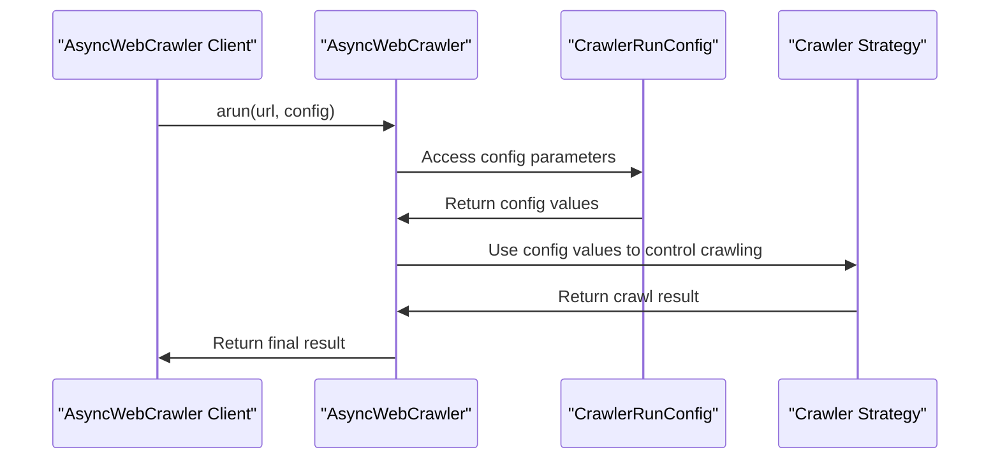

# Chapter 2: CrawlerRunConfig

In the [previous chapter](01_asyncwebcrawler.md), we explored `AsyncWebCrawler`, the core class for asynchronous web crawling in Crawl4AI. We learned how to use it to fetch and process web content. Now, let's dive into `CrawlerRunConfig`, which is used to customize the behavior of `AsyncWebCrawler` during the crawling process.

## What Problem Does CrawlerRunConfig Solve?

Imagine you're using `AsyncWebCrawler` to extract information from a website. You want to control how the crawler behaves, such as waiting for certain elements to load or excluding specific content. `CrawlerRunConfig` is designed to help you customize these aspects of the crawling process.

## Understanding CrawlerRunConfig

`CrawlerRunConfig` is a configuration class that allows you to control various aspects of the crawling process. It's like a settings menu that lets you tailor the crawler's behavior to your needs.

### Key Concepts

Let's break down some key concepts in `CrawlerRunConfig`:

1. **Content Processing**: You can control how the crawler processes the content, such as setting a minimum word count threshold or excluding certain HTML tags.
2. **Page Navigation and Timing**: You can configure how the crawler navigates the page, such as waiting for certain elements to load or setting a timeout for page operations.
3. **Caching**: You can control how the crawler uses caching, such as enabling or disabling caching or setting a cache mode.
4. **Media Handling**: You can configure how the crawler handles media, such as taking screenshots or generating PDFs.

## Using CrawlerRunConfig

To use `CrawlerRunConfig`, you create an instance of it and pass it to the `arun` method of `AsyncWebCrawler`. Here's a simple example:

```python
from crawl4ai import AsyncWebCrawler, CrawlerRunConfig, CacheMode

async def main():
    run_config = CrawlerRunConfig(
        verbose=True,
        cache_mode=CacheMode.ENABLED,
        wait_for="css:.main-content"
    )
    async with AsyncWebCrawler() as crawler:
        result = await crawler.arun(
            url="https://example.com",
            config=run_config
        )
        print(result.markdown)
```

In this example, we create a `CrawlerRunConfig` with `verbose=True`, `cache_mode=CacheMode.ENABLED`, and `wait_for="css:.main-content"`. We then pass this config to `AsyncWebCrawler` when calling `arun`.

## Inside CrawlerRunConfig

Let's dive deeper into how `CrawlerRunConfig` works internally. When you create a `CrawlerRunConfig` instance, it stores the configuration parameters you provide. When you pass this config to `AsyncWebCrawler`, it uses these parameters to control the crawling process.

Here's a simplified sequence diagram illustrating the process:



## Example Use Cases

Let's consider a few example use cases for `CrawlerRunConfig`:

1. **Waiting for dynamic content**: You can use `wait_for` to wait for a specific CSS selector to load before extracting content.
```python
run_config = CrawlerRunConfig(wait_for="css:.dynamic-content")
```

2. **Excluding certain content**: You can use `excluded_tags` to exclude certain HTML tags from processing.
```python
run_config = CrawlerRunConfig(excluded_tags=["nav", "footer"])
```

3. **Taking a screenshot**: You can use `screenshot` to take a screenshot of the page.
```python
run_config = CrawlerRunConfig(screenshot=True)
```

## Conclusion

In this chapter, we've introduced `CrawlerRunConfig`, which is used to customize the behavior of `AsyncWebCrawler` during the crawling process. We've explored its key concepts, how to use it, and a high-level overview of its internal workings. With this knowledge, you're ready to start using `CrawlerRunConfig` to tailor the crawling process to your needs.

In the [next chapter](03_browserconfig.md), we'll dive into `BrowserConfig`, which is used to configure the browser instance used by `AsyncWebCrawler`.

---

Generated by [AI Codebase Knowledge Builder](https://github.com/The-Pocket/Tutorial-Codebase-Knowledge)