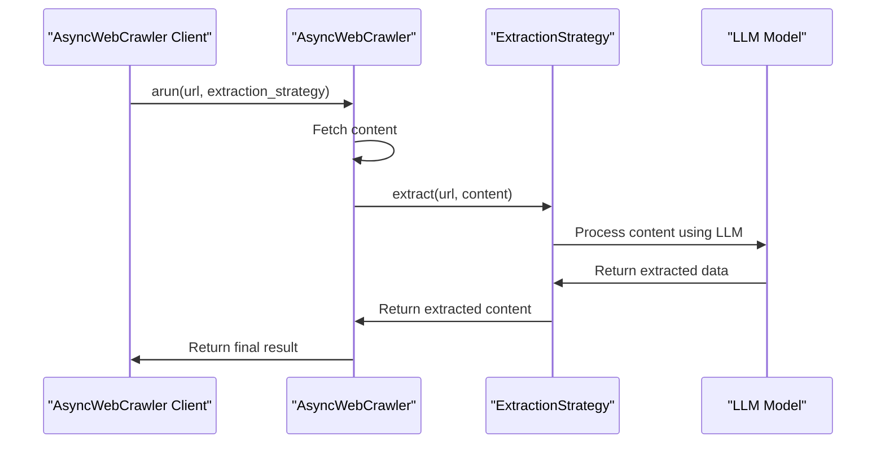

# Chapter 4: ExtractionStrategy

In the [previous chapter](03_browserconfig.md), we explored `BrowserConfig`, which is used to configure the browser instance used by `AsyncWebCrawler`. Now, let's dive into `ExtractionStrategy`, which is used to extract structured data from crawled pages.

## What Problem Does ExtractionStrategy Solve?

Imagine you've used `AsyncWebCrawler` to fetch the content of a webpage. Now, you want to extract specific information from that content, such as product details from an e-commerce site. `ExtractionStrategy` is designed to help you achieve this by providing a flexible way to extract meaningful data from the crawled content.

## Understanding ExtractionStrategy

`ExtractionStrategy` is an abstract base class that defines how to extract data from crawled webpages. It's like choosing the right tool for a specific job. Different strategies can be used depending on the structure of the webpage and the type of data you want to extract.

### Key Concepts

Let's break down some key concepts in `ExtractionStrategy`:

1. **Input Format**: The content format to use for extraction, such as "markdown" or "html".
2. **Extraction Methods**: Different strategies implement various extraction methods, such as using LLMs (Large Language Models) or CSS selectors.

## Using ExtractionStrategy

To use `ExtractionStrategy`, you need to create an instance of a concrete strategy class that inherits from `ExtractionStrategy`. Let's consider a simple example using `LLMExtractionStrategy`, which uses an LLM to extract meaningful content.

```python
from crawl4ai import AsyncWebCrawler, LLMExtractionStrategy, LLMConfig

# Create an LLM extraction strategy
strategy = LLMExtractionStrategy(
    llm_config=LLMConfig(provider="ollama/llama3"),
    instruction="Extract product information"
)

# Use AsyncWebCrawler with the extraction strategy
async with AsyncWebCrawler() as crawler:
    result = await crawler.arun(
        url="https://example.com/product",
        extraction_strategy=strategy
    )
    print(result.extracted_content)
```

In this example, we create an `LLMExtractionStrategy` with a specific LLM configuration and instruction. We then pass this strategy to `AsyncWebCrawler` when calling `arun`. The extracted content is then printed.

## Inside ExtractionStrategy

Let's dive deeper into how `ExtractionStrategy` works internally. When you call `arun` on an `AsyncWebCrawler` instance with an `ExtractionStrategy`, it performs the following steps:

1. **Fetch Content**: `AsyncWebCrawler` fetches the content of the specified URL.
2. **Process HTML**: The fetched HTML content is processed according to the input format specified in the extraction strategy.
3. **Extract Data**: The processed content is then passed to the `extract` method of the specified `ExtractionStrategy`, which extracts the relevant data.

Here's a simplified sequence diagram illustrating the process:



## Example Use Cases

Let's consider a few example use cases for `ExtractionStrategy`:

1. **Extracting Product Information**: You can use `LLMExtractionStrategy` to extract product details from an e-commerce website.
```python
strategy = LLMExtractionStrategy(
    llm_config=LLMConfig(provider="ollama/llama3"),
    instruction="Extract product name, price, and description"
)
```

2. **Extracting Structured Data using CSS Selectors**: You can use `JsonCssExtractionStrategy` to extract structured data based on CSS selectors.
```python
from crawl4ai import JsonCssExtractionStrategy

schema = {
    "baseSelector": ".product-card",
    "fields": [
        {"name": "title", "selector": "h2.title", "type": "text"},
        {"name": "price", "selector": ".price", "type": "text"}
    ]
}
strategy = JsonCssExtractionStrategy(schema)
```

## Conclusion

In this chapter, we've introduced `ExtractionStrategy`, which is used to extract structured data from crawled pages. We've explored its key concepts, how to use it with different strategies, and a high-level overview of its internal workings. With this knowledge, you're ready to start using `ExtractionStrategy` to extract meaningful data from webpages.

In the [next chapter](05_deepcrawlstrategy.md), we'll dive into `DeepCrawlStrategy`, which is used for deep crawling of websites.

---

Generated by [AI Codebase Knowledge Builder](https://github.com/The-Pocket/Tutorial-Codebase-Knowledge)