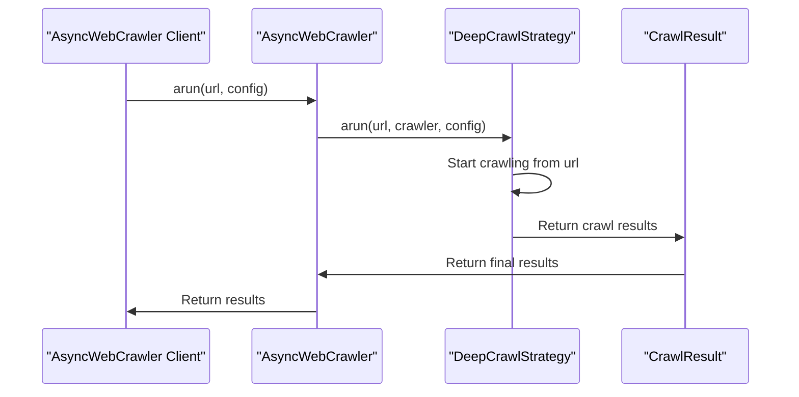

# Chapter 5: DeepCrawlStrategy

In the [previous chapter](04_extractionstrategy.md), we explored `ExtractionStrategy`, which is used to extract structured data from crawled pages. Now, let's dive into `DeepCrawlStrategy`, which is used for deep crawling of websites.

## What Problem Does DeepCrawlStrategy Solve?

Imagine you've used `AsyncWebCrawler` to fetch the content of a webpage. Now, you want to crawl not just the initial page, but also the pages linked from it, and possibly even the pages linked from those. `DeepCrawlStrategy` is designed to help you achieve this by providing a flexible way to explore a website beyond the initial page.

## Understanding DeepCrawlStrategy

`DeepCrawlStrategy` is an abstract base class that defines how to perform deep crawling. It's like choosing the right navigation system for a road trip - you need to decide how to explore the website.

### Key Concepts

Let's break down some key concepts in `DeepCrawlStrategy`:

1. **Crawling Strategy**: Different strategies (like BFS or DFS) can be used to explore the website.
2. **URL Processing**: The strategy decides how to process URLs found on a page.
3. **Depth Control**: You can control how deep the crawl goes.

## Using DeepCrawlStrategy

To use `DeepCrawlStrategy`, you need to create an instance of a concrete strategy class that inherits from `DeepCrawlStrategy` and pass it to `CrawlerRunConfig`. Let's consider a simple example using `BFSDeepCrawlStrategy`, which performs a breadth-first search.

```python
from crawl4ai import AsyncWebCrawler, CrawlerRunConfig
from crawl4ai.deep_crawling import BFSDeepCrawlStrategy

async def main():
    config = CrawlerRunConfig(
        deep_crawl_strategy=BFSDeepCrawlStrategy(max_depth=2),
    )
    async with AsyncWebCrawler() as crawler:
        results = await crawler.arun("https://example.com", config=config)
        print(f"Crawled {len(results)} pages")

# Explanation: We're creating a CrawlerRunConfig with a BFSDeepCrawlStrategy that goes 2 levels deep.
# Then we use AsyncWebCrawler to crawl the specified URL with this config.
```

## Inside DeepCrawlStrategy

Let's dive deeper into how `DeepCrawlStrategy` works internally. When you call `arun` on an `AsyncWebCrawler` instance with a `DeepCrawlStrategy`, it performs the following steps:

1. **Start Crawling**: It starts crawling from the given URL.
2. **Process Links**: For each crawled page, it extracts links and decides whether to crawl them based on the strategy.
3. **Continue Crawling**: It continues crawling until it reaches the specified depth or exhausts all links.

Here's a simplified sequence diagram illustrating the process:



## Example Use Cases

Let's consider a few example use cases for `DeepCrawlStrategy`:

1. **Crawling a Website**: You can use `BFSDeepCrawlStrategy` to crawl a website and its linked pages.
```python
config = CrawlerRunConfig(deep_crawl_strategy=BFSDeepCrawlStrategy(max_depth=1))
```

2. **Depth-First Crawling**: You can use `DFSDeepCrawlStrategy` for a depth-first search approach.
```python
from crawl4ai.deep_crawling import DFSDeepCrawlStrategy
config = CrawlerRunConfig(deep_crawl_strategy=DFSDeepCrawlStrategy(max_depth=2))
```

## Conclusion

In this chapter, we've introduced `DeepCrawlStrategy`, which is used for deep crawling of websites. We've explored its key concepts, how to use it with different strategies, and a high-level overview of its internal workings. With this knowledge, you're ready to start using `DeepCrawlStrategy` to explore websites beyond the initial page.

In the [next chapter](06_llmconfig.md), we'll dive into `LLMConfig`, which is used to configure Large Language Models for extraction strategies.

---

Generated by [AI Codebase Knowledge Builder](https://github.com/The-Pocket/Tutorial-Codebase-Knowledge)