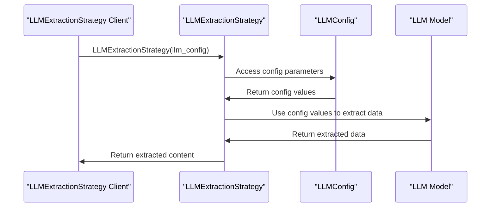

# Chapter 6: LLMConfig
In the [previous chapter](05_deepcrawlstrategy.md), we explored `DeepCrawlStrategy`, which is used for deep crawling of websites. Now, let's dive into `LLMConfig`, which is used to configure Large Language Models for extraction strategies.

## What Problem Does LLMConfig Solve?
Imagine you've used `AsyncWebCrawler` to fetch the content of a webpage and now you want to extract specific information from that content using a Large Language Model (LLM). You need to configure the LLM provider, such as specifying the model to use and the API token. `LLMConfig` is designed to help you achieve this by providing a flexible way to configure LLMs.

## Understanding LLMConfig
`LLMConfig` is a configuration class that allows you to control various aspects of LLM providers. It's like setting up a connection to a powerful AI assistant that helps with data extraction.

### Key Concepts
Let's break down some key concepts in `LLMConfig`:

1. **Provider**: The LLM provider to use, such as "openai/gpt-4o-mini" or "ollama/llama3". Different providers offer different models and capabilities.
2. **API Token**: The API token to use for the given provider. This is usually obtained from the provider's website and is used to authenticate your requests.
3. **Base URL**: The base URL of the LLM provider's API. This can be useful if you need to use a custom endpoint.

## Using LLMConfig
To use `LLMConfig`, you create an instance of it and pass it to the relevant strategies or functions that rely on LLMs. Let's consider a simple example using `LLMExtractionStrategy`, which uses an LLM to extract meaningful content.

```python
from crawl4ai import LLMConfig, LLMExtractionStrategy

llm_config = LLMConfig(provider="openai/gpt-4o-mini", api_token="your_api_token_here")
extraction_strategy = LLMExtractionStrategy(llm_config=llm_config)
```

In this example, we create an `LLMConfig` with a specific provider and API token. We then pass this config to `LLMExtractionStrategy`.

## Inside LLMConfig
Let's dive deeper into how `LLMConfig` works internally. When you create an `LLMConfig` instance, it stores the configuration parameters you provide.

Here's a simplified sequence diagram illustrating how `LLMConfig` is used with `LLMExtractionStrategy`:



## Example Use Cases
Let's consider a few example use cases for `LLMConfig`:

1. **Extracting Product Information**: You can use `LLMExtractionStrategy` with `LLMConfig` to extract product details from an e-commerce website.
```python
llm_config = LLMConfig(provider="ollama/llama3", api_token="your_api_token_here")
extraction_strategy = LLMExtractionStrategy(llm_config=llm_config)
```

2. **Generating Schema**: You can use `JsonCssExtractionStrategy.generate_schema` or `JsonXPathExtractionStrategy.generate_schema` with `LLMConfig` to generate a schema for structured data extraction.
```python
from crawl4ai import JsonCssExtractionStrategy

llm_config = LLMConfig(provider="openai/gpt-4o-mini", api_token="your_api_token_here")
schema = JsonCssExtractionStrategy.generate_schema(llm_config=llm_config)
```

## Conclusion
In this chapter, we've introduced `LLMConfig`, which is used to configure Large Language Models for extraction strategies. We've explored its key concepts, how to use it, and a high-level overview of its internal workings. With this knowledge, you're ready to start using `LLMConfig` to configure LLMs for your data extraction needs.

In the [next chapter](07_asynccrawlerstrategy.md), we'll dive into `AsyncCrawlerStrategy`, which is used to define custom crawling strategies.

---

Generated by [AI Codebase Knowledge Builder](https://github.com/The-Pocket/Tutorial-Codebase-Knowledge)