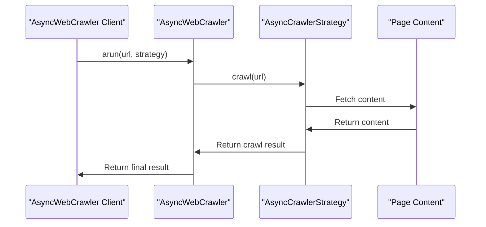

# Chapter 7: AsyncCrawlerStrategy

In the [previous chapter](06_llmconfig.md), we explored `LLMConfig`, which is used to configure Large Language Models for extraction strategies. Now, let's dive into `AsyncCrawlerStrategy`, which is used to define custom crawling strategies.

## What Problem Does AsyncCrawlerStrategy Solve?

Imagine you're using `AsyncWebCrawler` to fetch content from websites. You want to control how the crawler behaves, such as handling different types of content or customizing the crawling process. `AsyncCrawlerStrategy` is designed to help you achieve this by providing a flexible way to define custom crawling strategies.

## Understanding AsyncCrawlerStrategy

`AsyncCrawlerStrategy` is an abstract base class that defines how to perform asynchronous crawling. It's like choosing the right navigation system for a road trip - you need to decide how to explore the website.

### Key Concepts

Let's break down some key concepts in `AsyncCrawlerStrategy`:

1. **Crawling Strategy**: Different strategies can be used to crawl websites, such as using Playwright or HTTP requests.
2. **Customization**: You can customize the crawling process by implementing your own strategy.

## Using AsyncCrawlerStrategy

To use `AsyncCrawlerStrategy`, you need to create an instance of a concrete strategy class that inherits from `AsyncCrawlerStrategy`. Let's consider a simple example using `AsyncPlaywrightCrawlerStrategy`, which uses Playwright for crawling.

```python
from crawl4ai import AsyncWebCrawler, AsyncPlaywrightCrawlerStrategy

async def main():
    strategy = AsyncPlaywrightCrawlerStrategy()
    async with AsyncWebCrawler(strategy=strategy) as crawler:
        result = await crawler.arun(url="https://example.com")
        print(result.markdown)
```

In this example, we create an `AsyncPlaywrightCrawlerStrategy` and pass it to `AsyncWebCrawler`. The `arun` method is then used to crawl the specified URL.

## Inside AsyncCrawlerStrategy

Let's dive deeper into how `AsyncCrawlerStrategy` works internally. When you call `arun` on an `AsyncWebCrawler` instance with an `AsyncCrawlerStrategy`, it performs the following steps:

1. **Initialize Strategy**: The `AsyncWebCrawler` initializes the provided `AsyncCrawlerStrategy`.
2. **Crawl URL**: The `crawl` method of the strategy is called with the URL to be crawled.

Here's a simplified sequence diagram illustrating the process:



## Example Use Cases

Let's consider a few example use cases for `AsyncCrawlerStrategy`:

1. **Custom Crawling Strategy**: You can implement your own crawling strategy by inheriting from `AsyncCrawlerStrategy`.
```python
class CustomCrawlerStrategy(AsyncCrawlerStrategy):
    async def crawl(self, url, **kwargs):
        # Custom crawling logic here
        pass
```

2. **Using AsyncPlaywrightCrawlerStrategy**: You can use `AsyncPlaywrightCrawlerStrategy` for crawling with Playwright.
```python
strategy = AsyncPlaywrightCrawlerStrategy()
```

## Conclusion

In this chapter, we've introduced `AsyncCrawlerStrategy`, which is used to define custom crawling strategies. We've explored its key concepts, how to use it with different strategies, and a high-level overview of its internal workings. With this knowledge, you're ready to start using `AsyncCrawlerStrategy` to customize the crawling process for your needs.

In the [next chapter](08_crawlresult.md), we'll dive into `CrawlResult`, which represents the outcome of a crawling operation.

---

Generated by [AI Codebase Knowledge Builder](https://github.com/The-Pocket/Tutorial-Codebase-Knowledge)