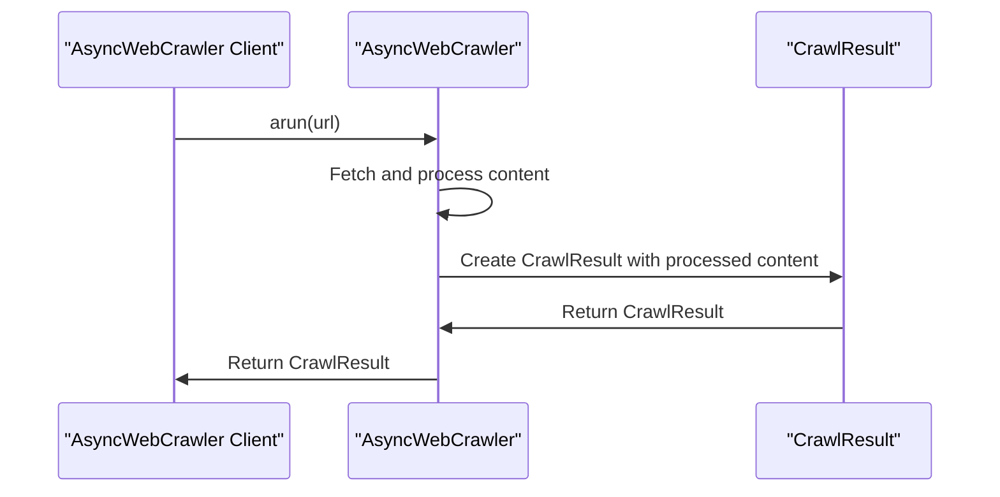

# Chapter 8: CrawlResult

In the [previous chapter](07_asynccrawlerstrategy.md), we explored `AsyncCrawlerStrategy`, which is used to define custom crawling strategies. Now, let's dive into `CrawlResult`, which represents the outcome of a crawling operation.

## What Problem Does CrawlResult Solve?

Imagine you've used `AsyncWebCrawler` to fetch the content of a webpage. You need a structured way to access the results of this crawl operation, including the content, metadata, and any errors that might have occurred. `CrawlResult` is designed to provide this structured access.

## Understanding CrawlResult

`CrawlResult` is a data model that encapsulates the result of a crawl operation. It's like a container that holds all the extracted information from a webpage.

### Key Concepts

Let's break down some key concepts in `CrawlResult`:

1. **Basic Crawl Info**: This includes the crawled URL, success status, status code, and error messages.
2. **Raw and Cleaned Content**: The original HTML and a sanitized version of it.
3. **Markdown Fields**: The conversion of HTML to Markdown, with options for citations and filtered content.
4. **Media and Links**: Information about discovered media and links on the page.
5. **Additional Fields**: Other useful information like extracted content, downloaded files, screenshots, PDFs, and metadata.

## Using CrawlResult

To use `CrawlResult`, you typically access its properties after calling `arun` on an `AsyncWebCrawler` instance. Let's consider a simple example:

```python
async with AsyncWebCrawler() as crawler:
    result = await crawler.arun(url="https://example.com")
    print(result.url)  # Prints the crawled URL
    print(result.markdown.raw_markdown[:200])  # Prints the first 200 characters of the raw Markdown
```

In this example, we use `AsyncWebCrawler` to crawl a URL and then access the `url` and `markdown` properties of the `CrawlResult`.

## Inside CrawlResult

Let's dive deeper into how `CrawlResult` works internally. When you call `arun` on an `AsyncWebCrawler` instance, it creates a `CrawlResult` object with the relevant information.

Here's a simplified sequence diagram illustrating the process:



## Example Use Cases

Let's consider a few example use cases for `CrawlResult`:

1. **Accessing Markdown Content**: You can access the raw Markdown content and other Markdown-related fields.
```python
if result.markdown:
    print(result.markdown.raw_markdown)
    print(result.markdown.markdown_with_citations)
    print(result.markdown.references_markdown)
```

2. **Checking for Errors**: You can check if the crawl operation was successful and access any error messages.
```python
if not result.success:
    print("Error:", result.error_message)
```

3. **Accessing Media and Links**: You can access information about media and links found on the page.
```python
images = result.media.get("images", [])
for img in images:
    print("Image:", img["src"])
```

## Conclusion

In this chapter, we've introduced `CrawlResult`, which represents the outcome of a crawling operation. We've explored its key concepts, how to use it, and a high-level overview of its internal workings. With this knowledge, you're ready to start using `CrawlResult` to access the results of your crawl operations.

In the [next chapter](09_crawlermonitor.md), we'll dive into `CrawlerMonitor`, which is used to monitor and manage crawling operations.

---

Generated by [AI Codebase Knowledge Builder](https://github.com/The-Pocket/Tutorial-Codebase-Knowledge)