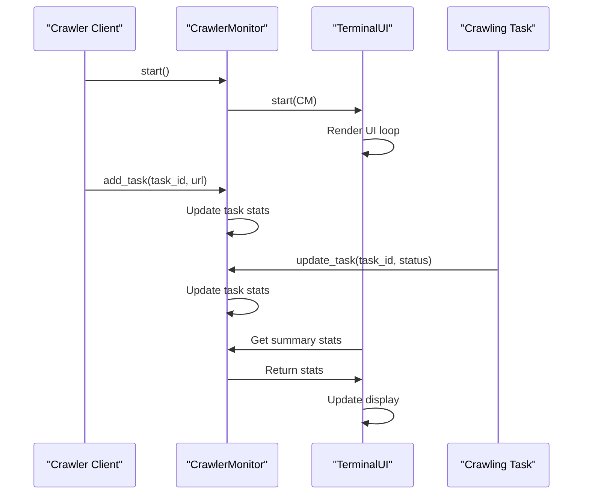

# Chapter 9: CrawlerMonitor

In the [previous chapter](08_crawlresult.md), we explored `CrawlResult`, which represents the outcome of a crawling operation. Now, let's dive into `CrawlerMonitor`, a comprehensive monitoring and visualization system for tracking web crawler operations.

## What Problem Does CrawlerMonitor Solve?

Imagine you're running a large-scale web crawling operation with multiple URLs to process. You need a way to monitor the progress, memory usage, and overall performance of your crawlers in real-time. `CrawlerMonitor` is designed to provide this monitoring capability, making it easier to manage and optimize your crawling operations.

## Understanding CrawlerMonitor

`CrawlerMonitor` is like a dashboard for your web crawling operations. It provides real-time insights into the status of your crawlers, memory usage, and task queue statistics.

### Key Concepts

Let's break down some key concepts in `CrawlerMonitor`:

1. **Task Tracking**: `CrawlerMonitor` tracks the status of individual tasks (URLs being crawled), including their status (QUEUED, IN_PROGRESS, COMPLETED, FAILED), memory usage, and duration.
2. **Memory Monitoring**: It monitors the memory usage of the crawling process and categorizes it into different statuses (NORMAL, PRESSURE, CRITICAL).
3. **Queue Statistics**: `CrawlerMonitor` provides insights into the task queue, including the number of tasks queued, the highest wait time, and the average wait time.
4. **Real-time UI**: It features a real-time terminal-based UI that updates periodically to reflect the current state of the crawling operation.

## Using CrawlerMonitor

To use `CrawlerMonitor`, you create an instance of it and start it before beginning your crawling operations. Let's consider a simple example:

```python
from crawl4ai import CrawlerMonitor

# Initialize the monitor
monitor = CrawlerMonitor(urls_total=100)
monitor.start()

# Your crawling code here...

# Stop the monitor when done
monitor.stop()
```

In this example, we initialize `CrawlerMonitor` with the total number of URLs to be crawled and start it. After your crawling operations are complete, you stop the monitor.

## Inside CrawlerMonitor

Let's dive deeper into how `CrawlerMonitor` works internally. When you start `CrawlerMonitor`, it initializes a thread that runs the UI rendering loop.

Here's a simplified sequence diagram illustrating the process:



## Example Use Cases

Let's consider a few example use cases for `CrawlerMonitor`:

1. **Monitoring Crawling Progress**: You can use `CrawlerMonitor` to track the progress of your crawling operations, including the number of URLs completed and the status of individual tasks.
```python
monitor.update_task(task_id="task1", status=CrawlStatus.IN_PROGRESS)
```

2. **Memory Usage Monitoring**: You can monitor the memory usage of your crawling process and take action if it exceeds certain thresholds.
```python
monitor.update_memory_status("PRESSURE")
```

## Code Implementation

The `CrawlerMonitor` class is implemented in `crawl4ai/components/crawler_monitor.py`. It uses a `TerminalUI` class to render the real-time UI.

```python
class CrawlerMonitor:
    def __init__(self, urls_total: int = 0, refresh_rate: float = 1.0, enable_ui: bool = True):
        # ...
        self.terminal_ui = TerminalUI(refresh_rate=refresh_rate) if enable_ui else None
```

The `TerminalUI` class uses the `rich` library to create a text-based UI.

```python
class TerminalUI:
    def __init__(self, refresh_rate: float = 1.0, max_width: int = 120):
        # ...
        self.console = Console(width=max_width)
        self.layout = Layout()
```

## Conclusion

In this chapter, we've introduced `CrawlerMonitor`, a powerful tool for monitoring and managing web crawling operations. We've explored its key concepts, how to use it, and a high-level overview of its internal workings. With this knowledge, you're ready to start using `CrawlerMonitor` to optimize your crawling operations.

In the [next chapter](10_cachemode.md), we'll dive into `CacheMode`, which is used to control caching behavior in Crawl4AI.

---

Generated by [AI Codebase Knowledge Builder](https://github.com/The-Pocket/Tutorial-Codebase-Knowledge)