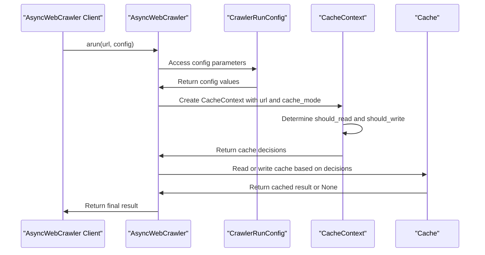

# Chapter 10: CacheMode

In the [previous chapter](09_crawlermonitor.md), we explored `CrawlerMonitor`, a comprehensive monitoring and visualization system for tracking web crawler operations. Now, let's dive into `CacheMode`, which is used to control caching behavior in Crawl4AI.

## What Problem Does CacheMode Solve?

Imagine you're using `AsyncWebCrawler` to fetch content from a website multiple times. You want to control how the crawler uses cached data to avoid unnecessary requests. `CacheMode` is designed to help you achieve this by providing a flexible way to configure caching behavior.

## Understanding CacheMode

`CacheMode` is an enum that defines the caching behavior for web crawling operations. It's like a switch that controls how the crawler uses cached data.

### Key Concepts

Let's break down the different modes in `CacheMode`:

1. **ENABLED**: Normal caching behavior (both read and write).
2. **DISABLED**: No caching at all.
3. **READ_ONLY**: Only read from cache, don't write.
4. **WRITE_ONLY**: Only write to cache, don't read.
5. **BYPASS**: Bypass cache for this operation.

## Using CacheMode

To use `CacheMode`, you create a `CrawlerRunConfig` instance with the desired cache mode and pass it to `AsyncWebCrawler`. Let's consider a simple example:

```python
from crawl4ai import AsyncWebCrawler, CrawlerRunConfig, CacheMode

async def main():
    config = CrawlerRunConfig(cache_mode=CacheMode.BYPASS)
    async with AsyncWebCrawler() as crawler:
        result = await crawler.arun(url="https://example.com", config=config)
        print(result.markdown)

# Explanation: We're creating a CrawlerRunConfig with CacheMode.BYPASS, meaning the cache will be bypassed for this operation.
```

In this example, we create a `CrawlerRunConfig` with `cache_mode=CacheMode.BYPASS`. This means that the cache will be bypassed for the crawling operation.

## Inside CacheMode

Let's dive deeper into how `CacheMode` works internally. When you call `arun` on an `AsyncWebCrawler` instance with a `CrawlerRunConfig` that specifies a `CacheMode`, it uses the `CacheContext` class to determine whether to read from or write to the cache.

Here's a simplified sequence diagram illustrating the process:



## Example Use Cases

Let's consider a few example use cases for `CacheMode`:

1. **Bypassing Cache**: You can use `CacheMode.BYPASS` to bypass the cache for a specific operation.
```python
config = CrawlerRunConfig(cache_mode=CacheMode.BYPASS)
```

2. **Disabling Cache**: You can use `CacheMode.DISABLED` to disable caching entirely.
```python
config = CrawlerRunConfig(cache_mode=CacheMode.DISABLED)
```

3. **Read-Only Cache**: You can use `CacheMode.READ_ONLY` to only read from the cache, without writing new results.
```python
config = CrawlerRunConfig(cache_mode=CacheMode.READ_ONLY)
```

## Code Implementation

The `CacheMode` enum is defined in `crawl4ai/cache_context.py`. It provides a clear and concise way to specify caching behavior.

```python
class CacheMode(Enum):
    ENABLED = "enabled"
    DISABLED = "disabled"
    READ_ONLY = "read_only"
    WRITE_ONLY = "write_only"
    BYPASS = "bypass"
```

## Conclusion

In this chapter, we've introduced `CacheMode`, which is used to control caching behavior in Crawl4AI. We've explored its key concepts, how to use it, and a high-level overview of its internal workings. With this knowledge, you're ready to start using `CacheMode` to optimize your web crawling operations.

This concludes our tutorial on the core concepts of Crawl4AI. You've now learned about the key components and configurations that make Crawl4AI a powerful tool for web crawling and data extraction.

---

Generated by [AI Codebase Knowledge Builder](https://github.com/The-Pocket/Tutorial-Codebase-Knowledge)