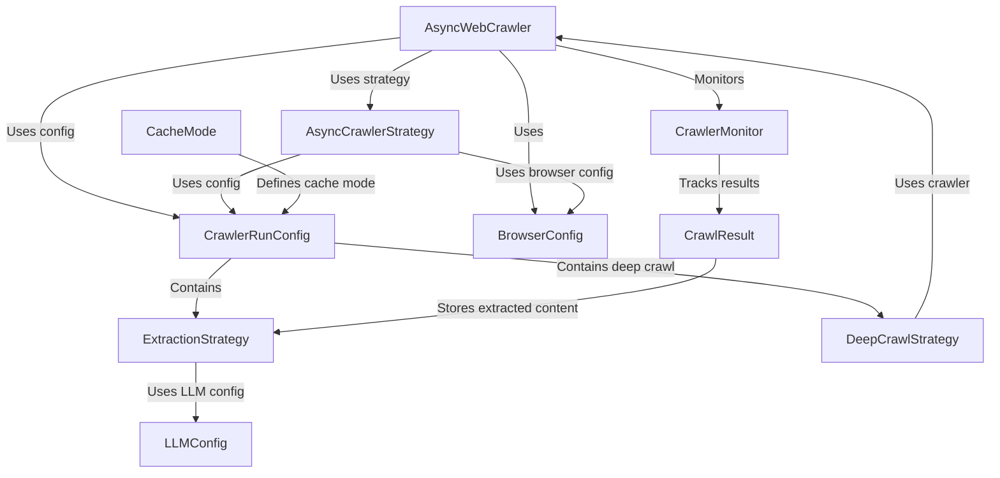

# Tutorial: crawl4ai

**Crawl4AI** is an *open-source*, *LLM-friendly* web crawler and scraper designed for **real-time data extraction**. 
It provides a flexible and efficient way to crawl web pages, extract structured data, and generate clean markdown output.
The project is actively maintained and offers various features like **deep crawling**, **browser integration**, and **configurable extraction strategies**.

**Source Repository:** [https://github.com/unclecode/crawl4ai](https://github.com/unclecode/crawl4ai)

## Chapters

1. [AsyncWebCrawler](01_asyncwebcrawler.md)
2. [CrawlerRunConfig](02_crawlerrunconfig.md)
3. [BrowserConfig](03_browserconfig.md)
4. [ExtractionStrategy](04_extractionstrategy.md)
5. [DeepCrawlStrategy](05_deepcrawlstrategy.md)
6. [LLMConfig](06_llmconfig.md)
7. [AsyncCrawlerStrategy](07_asynccrawlerstrategy.md)
8. [CrawlResult](08_crawlresult.md)
9. [CrawlerMonitor](09_crawlermonitor.md)
10. [CacheMode](10_cachemode.md)

---

Generated by [AI Codebase Knowledge Builder](https://github.com/The-Pocket/Tutorial-Codebase-Knowledge)