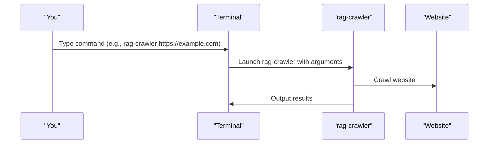

# Chapter 1: Command Line Interface

Welcome to the `rag-crawler` tutorial! In this chapter, we will explore the Command Line Interface (CLI), which is the primary way to interact with the `rag-crawler` application.

## What is a Command Line Interface?

Imagine you are at a restaurant, and instead of ordering food through a menu on a screen, you need to tell the waiter what you want by speaking to them. The Command Line Interface is similar; it's a way to communicate with a computer program by typing commands into a terminal or command prompt.

## Why Do We Need a Command Line Interface?

The `rag-crawler` is a tool designed to crawl websites and extract useful information. To use this tool effectively, you need to tell it what website to crawl, how to crawl it, and what information to extract. The CLI provides a simple and efficient way to pass these instructions to the `rag-crawler` application.

## Understanding the `rag-crawler` Command

Let's start with a simple example. Suppose you want to crawl a website with the URL `https://example.com`. To do this using `rag-crawler`, you would open a terminal and type the following command:
```bash
rag-crawler https://example.com
```
This command tells `rag-crawler` to start crawling from the specified URL.

### Breaking Down the Command

The `rag-crawler` command is composed of several parts:
- `rag-crawler`: This is the name of the command.
- `https://example.com`: This is an argument that specifies the URL to start crawling from.

### Options

You can customize the behavior of `rag-crawler` by using various options. For example, you can specify the maximum number of concurrent connections using the `--max-connections` option:
```bash
rag-crawler https://example.com --max-connections 10
```
This command tells `rag-crawler` to crawl the website with up to 10 concurrent connections.

Let's look at how this is implemented in the code. The `src/bin.ts` file defines the CLI using the `commander` library:
```typescript
program
  .name("rag-crawler")
  .argument("<startUrl>", "The URL to start crawling from")
  .option("--max-connections <int>", "Maximum concurrent connections", parseInt);
```
This code snippet defines the `rag-crawler` command with a required `startUrl` argument and an optional `--max-connections` option.

## How the Command Line Interface Works

When you run the `rag-crawler` command, here's what happens under the hood:

1. You type the command into a terminal and press Enter.
2. The `rag-crawler` application is launched, and it parses the command-line arguments and options.
3. Based on the provided arguments and options, `rag-crawler` configures its crawling process.
4. The crawling process is executed, and the results are outputted to the console or saved to a file.

Here's a simplified sequence diagram illustrating this process:


## What's Next?

In this chapter, you learned about the Command Line Interface and how to use it to interact with the `rag-crawler` application. You now know how to specify the URL to crawl and customize the crawling process using options.

In the next chapter, [Crawl Options](02_crawl_options.md), we will dive deeper into the various options available for customizing the crawling process.

---

Generated by [AI Codebase Knowledge Builder](https://github.com/The-Pocket/Tutorial-Codebase-Knowledge)