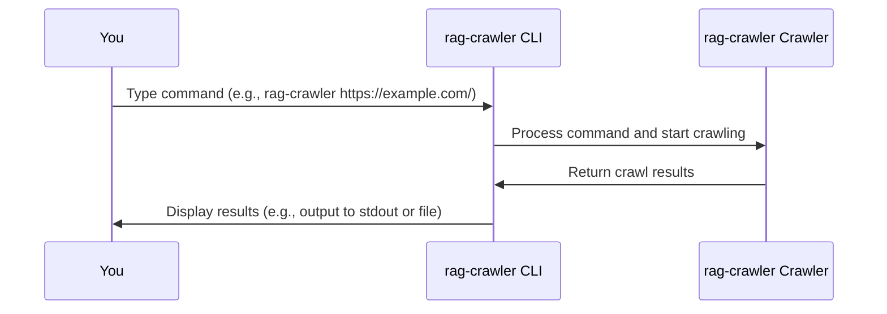

# Chapter 1: Command-Line Interface (CLI)
Welcome to the world of `rag-crawler`! In this chapter, we'll explore the Command-Line Interface (CLI), the primary way you interact with `rag-crawler`. The CLI is like a control panel that lets you customize the behavior of the crawler.

## What is Command-Line Interface (CLI)?
Imagine you're at a restaurant, and you want to order food. You need to tell the waiter what you want, right? The CLI is similar; it's how you tell `rag-crawler` what to do. You type commands, and `rag-crawler` responds by performing the specified actions.

## Using the CLI
Let's start with a simple example. Suppose you want to crawl a website to generate a knowledge file. You can use the following command:
```bash
rag-crawler https://sigoden.github.io/mynotes/languages/
```
This command tells `rag-crawler` to start crawling from the specified URL.

### Understanding the Command Structure
Let's break down the command:
- `rag-crawler`: This is the name of the command.
- `https://sigoden.github.io/mynotes/languages/`: This is the argument, specifically the URL you want to start crawling from.

### Options and Arguments
You can customize the behavior of `rag-crawler` using options and arguments. For example:
```bash
rag-crawler https://sigoden.github.io/mynotes/languages/ data.json
```
Here, `https://sigoden.github.io/mynotes/languages/` is the `<startUrl>` argument, and `data.json` is the `[outPath]` argument.

You can also use options like `--preset` or `--max-connections` to further customize the crawl:
```bash
rag-crawler https://sigoden.github.io/mynotes/languages/ --preset auto --max-connections 5
```
This command uses the `auto` preset and sets the maximum concurrent connections to 5.

## How the CLI Works
When you run a command, `rag-crawler` processes it and performs the specified actions. Here's a simplified overview of what happens:

The CLI takes your command, processes it, and then instructs the crawler to perform the specified actions. The crawler does the actual work and returns the results to the CLI, which then displays the results to you.

## Internal Implementation
The CLI is implemented using the `commander` library in the `src/bin.ts` file. Here's a simplified example of how the CLI is defined:
```javascript
program
  .name("rag-crawler")
  .argument("<startUrl>", "The URL to start crawling from")
  .argument("[outPath]", "The output path")
  .option("--preset <value>", "Use predefined crawl options", "auto");
```
This code defines the `rag-crawler` command with its arguments and options.

## Conclusion
In this chapter, you've learned about the Command-Line Interface (CLI) and how to use it to interact with `rag-crawler`. You've seen how to structure commands, use options and arguments, and understood the basics of how the CLI works. In the next chapter, we'll dive into [Presets](02_preset.md), which allow you to reuse predefined crawl options.

---

Generated by [AI Codebase Knowledge Builder](https://github.com/The-Pocket/Tutorial-Codebase-Knowledge)