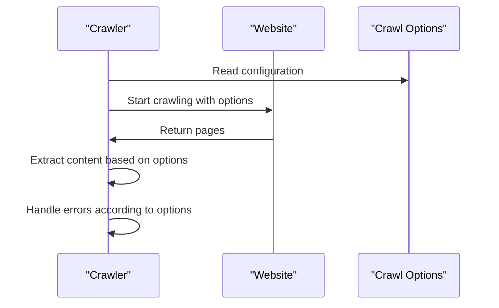

# Chapter 2: Crawl Options
In the previous chapter, [Command Line Interface](01_command_line_interface.md), we explored how to interact with the `rag-crawler` application using the command line. We learned how to specify the URL to crawl and customize the crawling process using options.

Now, let's dive deeper into the configuration options that control the crawling process. Imagine you're planning a trip to a new city. You need to decide how to get there, what to pack, and how to navigate the city. Similarly, when crawling a website, you need to configure the crawler to suit your needs.

## What are Crawl Options?
Crawl Options define the configuration for the crawling process, allowing you to customize parameters such as maximum connections and content extraction. Think of it like a control panel where you can adjust settings to get the desired outcome.

## Key Concepts
Let's break down the key concepts:

* **Maximum Connections**: This determines how many pages the crawler can fetch simultaneously. Imagine you're downloading multiple files at once; too many can slow down your internet.
* **Content Extraction**: This allows you to specify what content to extract from the crawled pages. For example, you might want to extract only the text within a specific HTML element.
* **Exclude Paths**: You can specify paths to exclude from the crawl, like ignoring certain directories or files.
* **Error Handling**: You can choose whether to stop the crawling process on the first error or continue despite errors.
* **Logging**: You can enable or disable logging to see what's happening during the crawl.

## Using Crawl Options
To use Crawl Options, you'll need to pass them to the `crawlWebsite` function. Here's an example:
```typescript
const options: CrawlOptions = {
  maxConnections: 10,
  extract: ".main-content",
};

for await (const page of crawlWebsite("https://example.com", options)) {
  console.log(page.text);
}
```
In this example, we're setting the maximum connections to 10 and extracting content from elements with the class `main-content`.

### Simplified Code Explanation
The `CrawlOptions` interface defines the available options:
```typescript
export interface CrawlOptions {
  extract?: string;
  maxConnections: number;
  exclude: string[];
  breakOnError: boolean;
  logEnabled: boolean;
  fetchOptions: RequestInit;
}
```
The `crawlWebsite` function takes these options into account when crawling the website:
```typescript
export async function* crawlWebsite(
  startUrl: string,
  options_?: Partial<CrawlOptions>,
) {
  // ...
}
```
## How Crawl Options Work Internally
Let's take a look at what happens when you call `crawlWebsite` with custom options.

Here's a simplified sequence diagram:

The `crawlWebsite` function reads the provided options and adjusts its behavior accordingly. It then starts crawling the website, extracting content, and handling errors based on the configured options.

## What's Next?
In this chapter, you learned about Crawl Options and how to customize the crawling process. You now know how to adjust parameters like maximum connections and content extraction.

In the next chapter, [Crawl Preset](03_crawl_preset.md), we'll explore pre-defined configurations for common use cases, making it easier to get started with `rag-crawler`.

---

Generated by [AI Codebase Knowledge Builder](https://github.com/The-Pocket/Tutorial-Codebase-Knowledge)