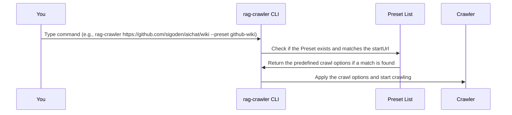

# Chapter 2: Preset
In the previous chapter, [Command-Line Interface (CLI)](01_command_line_interface__cli_.md), we explored how to interact with `rag-crawler` using commands. We learned how to structure commands, use options, and understand the basics of how the CLI works. Now, let's dive into the concept of "Preset" and see how it simplifies the configuration process for common web scraping tasks.

## What is a Preset?
Imagine you're at a restaurant, and you want to order a meal. Instead of telling the waiter every detail about your meal, like the ingredients and cooking method, you simply say, "I'll have the special of the day." A Preset in `rag-crawler` is similar; it's a predefined set of options that simplifies the configuration process for specific websites or use cases.

## Why Use Presets?
Let's consider a concrete example. Suppose you want to crawl a GitHub Wiki page. To enhance scraping quality, you need to configure both `--exclude` and `--extract` options. The command might look like this:
```bash
rag-crawler https://github.com/sigoden/aichat/wiki wiki.json --exclude _history --extract '#wiki-body'
```
Since all GitHub Wiki websites share these crawl options, you can define a Preset for reusability. This allows for a simplified command:
```bash
rag-crawler https://github.com/sigoden/aichat/wiki wiki.json --preset github-wiki
```
## How to Use Presets
To use a Preset, you simply need to specify the `--preset` option followed by the name of the Preset. For example:
```bash
rag-crawler https://github.com/sigoden/aichat/wiki wiki.json --preset github-wiki
```
You can also use the `auto` Preset, which allows `rag-crawler` to automatically determine the appropriate Preset based on the `startUrl`.
```bash
rag-crawler https://github.com/sigoden/aichat/wiki wiki.json --preset auto
```
## Understanding Presets
A Preset consists of three key components:
1. `name`: The name of the Preset.
2. `test`: A regular expression that matches the `startUrl`.
3. `options`: The predefined crawl options.

Here's an example of a Preset:
```javascript
{
  name: "github-wiki",
  test: "github.com/([^/]+)/([^/]+)/wiki",
  options: {
    exclude: ["_history"],
    extract: "#wiki-body",
  },
}
```
This Preset is named "github-wiki" and matches any URL that contains "github.com/username/repository/wiki". The `options` define the crawl options, in this case, excluding paths with "_history" and extracting content using the CSS selector "#wiki-body".

## How Presets Work Internally
When you run a command with a Preset, `rag-crawler` processes it as follows:

The CLI checks if the specified Preset exists and matches the `startUrl`. If a match is found, it applies the predefined crawl options and starts crawling.

## Customizing Presets
You can add custom Presets by editing the `~/.rag-crawler.json` file. For example:
```json
[
  {
    "name": "my-preset",
    "test": "example.com/([^/]+)",
    "options": {
      "exclude": ["path1", "path2"],
      "extract": "#content"
    }
  }
]
```
## Conclusion
In this chapter, you've learned about Presets in `rag-crawler` and how they simplify the configuration process for common web scraping tasks. You've seen how to use Presets, understand their components, and customize them. In the next chapter, [Crawl Options](03_crawl_options.md), we'll explore the various crawl options available in `rag-crawler` and how to customize them.

---

Generated by [AI Codebase Knowledge Builder](https://github.com/The-Pocket/Tutorial-Codebase-Knowledge)