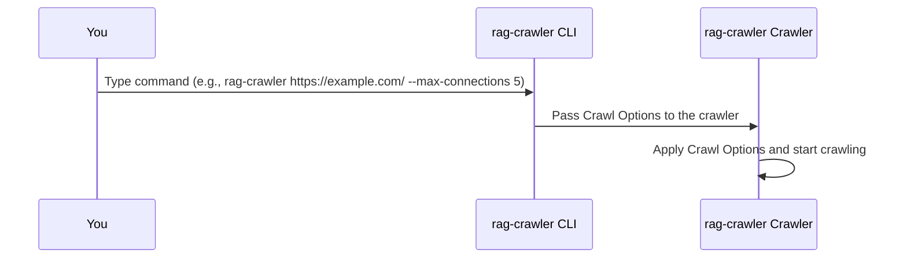

# Chapter 3: Crawl Options
In the previous chapter, [Preset](02_preset.md), we explored how to simplify the configuration process for common web scraping tasks using Presets. Now, let's dive into the concept of "Crawl Options" and see how it allows you to customize the behavior of the web crawler.

## What are Crawl Options?
Imagine you're on a treasure hunt, and you need to navigate through a dense forest. You'd want to control how you move through the forest, right? Crawl Options are like the controls that let you customize how `rag-crawler` navigates through a website.

## Why Use Crawl Options?
Let's consider a concrete example. Suppose you want to crawl a website with many pages, but you don't want to overload the server with too many requests at once. You can use Crawl Options to control the maximum number of concurrent connections.

## Key Concepts
Crawl Options consist of several key components:
1. `maxConnections`: The maximum number of concurrent connections allowed.
2. `exclude`: A list of path names to exclude from crawling.
3. `extract`: A CSS selector to extract specific content.

### maxConnections
`maxConnections` controls how many pages `rag-crawler` can crawl simultaneously. For example, if you set `maxConnections` to 5, `rag-crawler` will crawl up to 5 pages at the same time.

```javascript
{
  maxConnections: 5,
}
```
This means that `rag-crawler` will not overload the server with too many requests.

### exclude
`exclude` is a list of path names that you want to exclude from crawling. For example, if you want to exclude paths with "_history" in the name, you can add "_history" to the `exclude` list.

```javascript
{
  exclude: ["_history"],
}
```
This ensures that `rag-crawler` skips pages with "_history" in the URL.

### extract
`extract` is a CSS selector that allows you to extract specific content from a webpage. For example, if you want to extract content within the element with the id "main-content", you can use the CSS selector "#main-content".

```javascript
{
  extract: "#main-content",
}
```
This tells `rag-crawler` to extract the content within the "#main-content" element.

## Using Crawl Options
To use Crawl Options, you can pass them as command-line options or use a Preset. For example, to set `maxConnections` to 5, you can use the following command:
```bash
rag-crawler https://example.com/ --max-connections 5
```
You can also combine multiple Crawl Options:
```bash
rag-crawler https://example.com/ --max-connections 5 --exclude _history --extract "#main-content"
```
This command sets `maxConnections` to 5, excludes paths with "_history", and extracts content within the "#main-content" element.

## How Crawl Options Work Internally
When you run a command with Crawl Options, `rag-crawler` processes it as follows:

The CLI passes the Crawl Options to the crawler, which then applies them and starts crawling.

## Internal Implementation
The Crawl Options are implemented in the `src/index.ts` file. The `CrawlOptions` interface defines the available options:
```javascript
export interface CrawlOptions {
  maxConnections: number;
  exclude: string[];
  extract?: string;
  // ...
}
```
The `crawlWebsite` function takes these options into account when crawling a website:
```javascript
export async function* crawlWebsite(
  startUrl: string,
  options: Partial<CrawlOptions>,
) {
  // ...
  const batch = paths.slice(index, index + options.maxConnections);
  // ...
}
```
## Conclusion
In this chapter, you've learned about Crawl Options and how they allow you to customize the behavior of the web crawler. You've seen how to use Crawl Options to control the maximum number of concurrent connections, exclude certain paths, and extract specific content. In the next chapter, [Web Crawler](04_web_crawler.md), we'll explore how the web crawler works internally.

---

Generated by [AI Codebase Knowledge Builder](https://github.com/The-Pocket/Tutorial-Codebase-Knowledge)