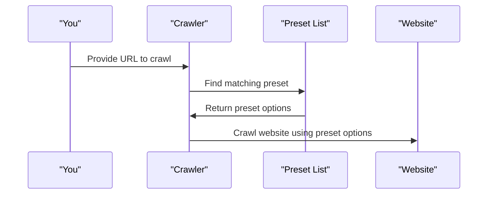

# Chapter 3: Crawl Preset

In the previous chapter, [Crawl Options](02_crawl_options.md), we explored how to customize the crawling process using various options. Now, let's dive into Crawl Presets, which simplify the process by providing predefined configurations for specific types of websites.

## What is a Crawl Preset?

Imagine you're planning a trip to a new city. You can either plan every detail yourself or use a pre-made travel package that includes everything you need. Crawl Presets are like these travel packages for web crawling. They provide pre-defined configurations for crawling specific types of websites, making it easier to get started with `rag-crawler`.

## Why Use Crawl Presets?

Let's say you want to crawl a GitHub repository. You could manually configure the crawl options, such as excluding certain paths and extracting specific content. However, with Crawl Presets, you can simply use a pre-defined configuration for GitHub repositories, saving you time and effort.

## Key Concepts

Let's break down the key concepts:

* **Preset Name**: A unique name for the preset, such as "github-repo".
* **Test**: A regular expression that determines whether the preset applies to a given URL.
* **Options**: The crawl options associated with the preset, such as exclude paths and extract selectors.

## Using Crawl Presets

To use a Crawl Preset, you need to identify the preset that matches the website you want to crawl. Let's say you want to crawl a GitHub repository. You can use the "github-repo" preset, which is pre-defined in `rag-crawler`.

Here's an example:
```typescript
import PRESET_LIST from './preset';

const url = 'https://github.com/user/repo';
const preset = PRESET_LIST.find((preset) => new RegExp(preset.test).test(url));

if (preset) {
  console.log(`Using preset: ${preset.name}`);
  // Use the preset options to crawl the website
} else {
  console.log('No preset found');
}
```
In this example, we're finding the preset that matches the given URL. If a preset is found, we can use its options to crawl the website.

### Simplified Code Explanation

The `PRESET_LIST` is an array of preset objects, each with a name, test regular expression, and options:
```typescript
const PRESET_LIST: Preset[] = [
  {
    name: "github-repo",
    test: "github.com/([^/]+)/([^/]+)/tree/([^/]+)",
    options: {
      exclude: ["changelog", "changes", "license"],
    },
  },
  // ...
];
```
The `Preset` interface defines the structure of a preset:
```typescript
export interface Preset {
  name: string;
  test: string;
  options: {
    exclude?: string[];
    extract?: string;
    maxConnections?: number;
    headers?: Record<string, string>;
  };
}
```
## How Crawl Presets Work Internally

Let's take a look at what happens when you use a Crawl Preset.

Here's a simplified sequence diagram:

The `Crawler` finds the matching preset from the `PresetList` based on the provided URL. It then uses the preset options to crawl the website.

## What's Next?

In this chapter, you learned about Crawl Presets and how they simplify the web crawling process. You now know how to use pre-defined configurations for specific types of websites.

In the next chapter, [Website Crawler](04_website_crawler.md), we'll dive into the core functionality of `rag-crawler` and explore how it crawls websites.

---

Generated by [AI Codebase Knowledge Builder](https://github.com/The-Pocket/Tutorial-Codebase-Knowledge)