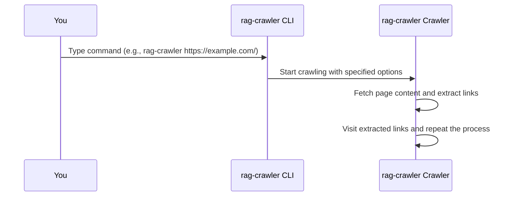

# Chapter 4: Web Crawler
In the previous chapter, [Crawl Options](03_crawl_options.md), we explored how to customize the behavior of `rag-crawler` using various options. Now, let's dive into the heart of `rag-crawler`: the Web Crawler.

## What is a Web Crawler?
Imagine you're a librarian tasked with cataloging all the books on a vast bookshelf. You'd start by looking at the first book, then move to the next, and so on. A Web Crawler works similarly, but instead of books, it navigates through web pages, following links and gathering information.

## Why Use a Web Crawler?
Let's consider a concrete example. Suppose you want to extract information from a website with many interconnected pages. You could manually visit each page, but that would be time-consuming and tedious. A Web Crawler automates this process, allowing you to focus on more important tasks.

## How Does a Web Crawler Work?
The Web Crawler starts with a given URL, known as the `startUrl`. It then:
1. Fetches the content of the page at the `startUrl`.
2. Extracts links from the page.
3. Visits each link, fetching their content and extracting further links.
4. Continues this process until it has visited all relevant pages.

## Key Concepts
The Web Crawler has several key components:
1. `startUrl`: The initial URL where the crawl begins.
2. `maxConnections`: The maximum number of pages the crawler can visit simultaneously.
3. `exclude`: A list of path names to exclude from crawling.

### startUrl
The `startUrl` is the starting point for the Web Crawler. For example, if you want to crawl a website, you would provide its URL as the `startUrl`.

### maxConnections
`maxConnections` controls how many pages the crawler can visit at the same time. For example, if `maxConnections` is set to 5, the crawler will visit up to 5 pages simultaneously.

### exclude
`exclude` is a list of path names that you want to exclude from crawling. For example, if you want to exclude paths with "_history" in the name, you can add "_history" to the `exclude` list.

## Using the Web Crawler
To use the Web Crawler, you simply need to provide the `startUrl` and any desired options. For example:
```bash
rag-crawler https://example.com/
```
This command starts the Web Crawler at the specified URL.

You can also customize the crawl using options like `maxConnections` and `exclude`:
```bash
rag-crawler https://example.com/ --max-connections 5 --exclude _history
```
This command sets `maxConnections` to 5 and excludes paths with "_history".

## Internal Implementation
When you run a command with `rag-crawler`, the following sequence occurs:

The CLI takes your command, processes it, and then instructs the Crawler to start crawling. The Crawler fetches page content, extracts links, and continues the process until it has visited all relevant pages.

The Web Crawler is implemented in the `src/index.ts` file. The `crawlWebsite` function is the core of the Web Crawler:
```javascript
export async function* crawlWebsite(
  startUrl: string,
  options: Partial<CrawlOptions>,
): AsyncGenerator<Page, any, Page> {
  // ...
}
```
This function takes the `startUrl` and `options` as input and yields pages as it crawls.

## Conclusion
In this chapter, you've learned about the Web Crawler and how it works. You've seen how to use it to extract information from websites and customize its behavior using various options. In the next chapter, [Page Processing](05_page_processing.md), we'll explore how `rag-crawler` processes the pages it crawls.

---

Generated by [AI Codebase Knowledge Builder](https://github.com/The-Pocket/Tutorial-Codebase-Knowledge)