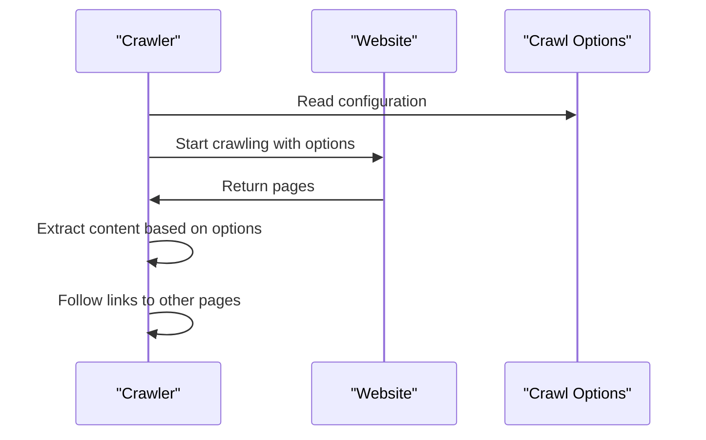

# Chapter 4: Website Crawler

In the previous chapter, [Crawl Preset](03_crawl_preset.md), we explored how to simplify the web crawling process using pre-defined configurations. Now, let's dive into the core functionality of `rag-crawler` and explore how it crawls websites.

## What is a Website Crawler?

Imagine you're a researcher trying to gather information from a website. You could manually visit each page, extract the relevant information, and follow links to other pages. However, this process can be tedious and time-consuming. A Website Crawler is a tool that automates this process, allowing you to extract information from a website efficiently.

## Why Do We Need a Website Crawler?

Let's say you want to extract information from a website with multiple pages, such as a blog or a documentation site. You can use a Website Crawler to automate the process of visiting each page, extracting the relevant information, and following links to other pages.

## Key Concepts

Let's break down the key concepts:

* **Start URL**: The URL where the crawler starts crawling.
* **Crawl Options**: The configuration options that control the crawling process, such as maximum connections and content extraction.
* **Page**: The extracted information from a webpage, including the text content and links to other pages.

## Using the Website Crawler

To use the Website Crawler, you need to provide the start URL and crawl options. Here's an example:
```typescript
import { crawlWebsite } from './index';

const startUrl = 'https://example.com';
const options = {
  maxConnections: 10,
  extract: '.main-content',
};

for await (const page of crawlWebsite(startUrl, options)) {
  console.log(page.text);
}
```
In this example, we're crawling the website starting from `https://example.com`, with a maximum of 10 concurrent connections, and extracting content from elements with the class `main-content`.

### Simplified Code Explanation

The `crawlWebsite` function takes the start URL and crawl options as input and returns an async generator that yields the extracted pages:
```typescript
export async function* crawlWebsite(
  startUrl: string,
  options_?: Partial<CrawlOptions>,
): AsyncGenerator<Page, any, Page> {
  // ...
}
```
The `Page` interface defines the structure of the extracted page:
```typescript
export interface Page {
  path: string;
  text: string;
}
```
## How the Website Crawler Works Internally

Let's take a look at what happens when you call `crawlWebsite`.

Here's a simplified sequence diagram:

The `Crawler` reads the provided crawl options and starts crawling the website. It extracts the content from each page based on the options and follows links to other pages.

The `crawlWebsite` function is implemented in `src/index.ts`. It uses a while loop to crawl the website in batches, with each batch consisting of multiple pages:
```typescript
let index = 0;
while (index < paths.length) {
  const batch = paths.slice(index, index + options.maxConnections);
  // ...
}
```
The `crawlPage` function is responsible for crawling a single page and extracting the content:
```typescript
async function crawlPage(
  startUrl: string,
  path: string,
  options: CrawlOptions,
) {
  // ...
}
```
## What's Next?

In this chapter, you learned about the Website Crawler and how it automates the process of extracting information from a website. You now know how to use the `crawlWebsite` function to crawl a website and extract relevant information.

In the next chapter, [Crawled Page](05_crawled_page.md), we'll explore the `Page` object and how to work with the extracted information.

---

Generated by [AI Codebase Knowledge Builder](https://github.com/The-Pocket/Tutorial-Codebase-Knowledge)