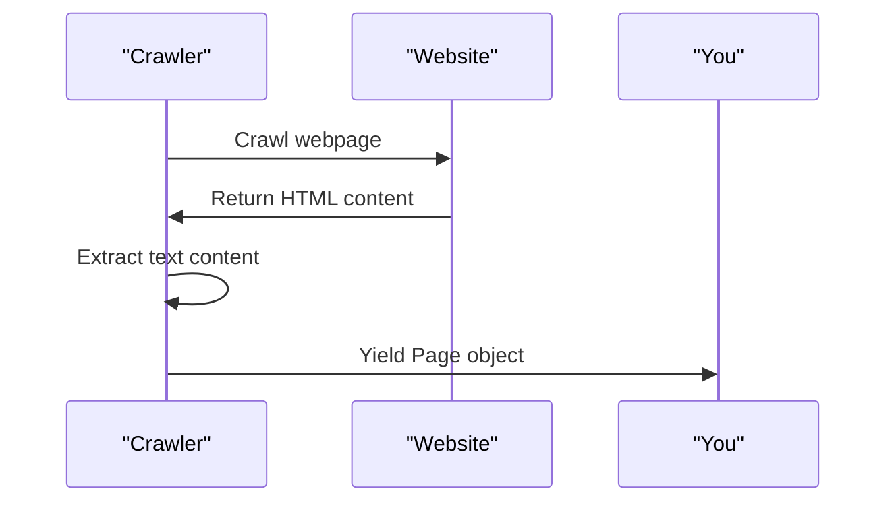

# Chapter 5: Crawled Page

In the previous chapter, [Website Crawler](04_website_crawler.md), we explored how to use the `crawlWebsite` function to extract information from a website. Now, let's dive into the `Page` object, which represents a crawled web page.

## What is a Crawled Page?

Imagine you're browsing a website and you come across a page with useful information. You might want to save the page's URL and the text content for later use. A Crawled Page is like a digital snapshot of that webpage, containing its URL path and the extracted text content.

## Why Do We Need a Crawled Page?

Let's say you want to analyze the content of a webpage or store it in a database. You need a structured representation of the webpage, which is where the `Page` object comes in.

## Key Concepts

Let's break down the key concepts:

* **Path**: The URL path of the crawled webpage.
* **Text**: The extracted text content from the webpage.

## Using the Crawled Page

When you use the `crawlWebsite` function, it yields a `Page` object for each crawled webpage. Here's an example:
```typescript
for await (const page of crawlWebsite("https://example.com", {})) {
  console.log(page.path);
  console.log(page.text);
}
```
In this example, we're crawling the website starting from `https://example.com` and logging the URL path and text content of each crawled page.

### Simplified Code Explanation

The `Page` interface defines the structure of a crawled page:
```typescript
export interface Page {
  path: string;
  text: string;
}
```
The `path` property contains the URL path of the crawled webpage, and the `text` property contains the extracted text content.

## How the Crawled Page Works Internally

Let's take a look at what happens when the `crawlWebsite` function yields a `Page` object.

Here's a simplified sequence diagram:

The `Crawler` crawls the webpage, extracts the text content, and yields a `Page` object containing the URL path and text content.

The `crawlPage` function is responsible for crawling a single page and extracting the content:
```typescript
async function crawlPage(
  startUrl: string,
  path: string,
  options: CrawlOptions,
) {
  // ...
  return {
    path,
    text,
    links: [...new Set(links)],
  };
}
```
In this code snippet, we're extracting the text content and returning a `Page` object with the URL path and text content.

## What's Next?

In this chapter, you learned about the `Page` object and how it represents a crawled web page. You now know how to work with the extracted information from a webpage.

In the next chapter, we will explore more advanced topics. However, since this is the last chapter of the tutorial, we'll conclude with a brief summary of what you've learned so far. You've successfully learned how to use the `rag-crawler` tool to extract information from websites using the Command Line Interface, Crawl Options, Crawl Presets, and Website Crawler. You can now apply these skills to real-world projects.

---

Generated by [AI Codebase Knowledge Builder](https://github.com/The-Pocket/Tutorial-Codebase-Knowledge)