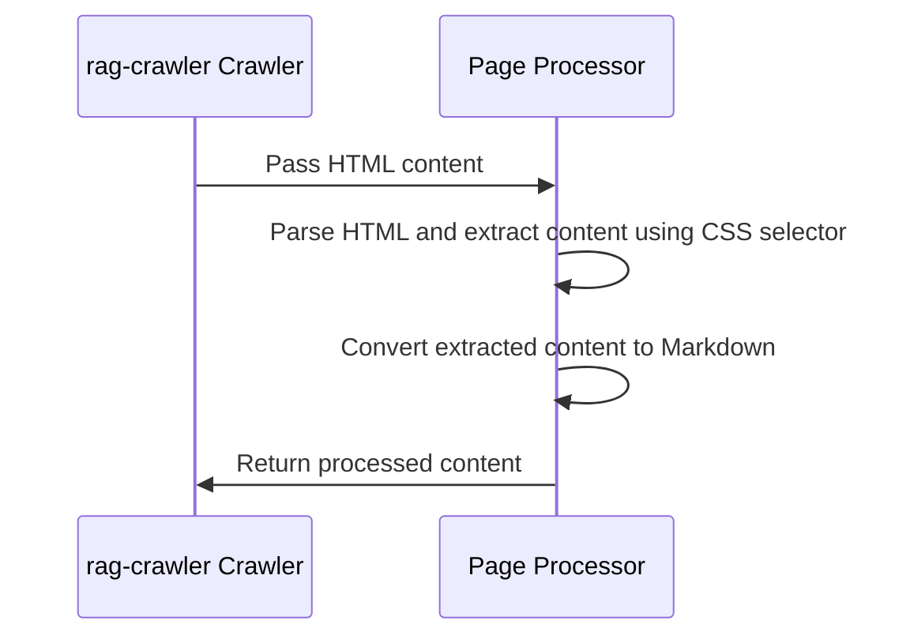

# Chapter 5: Page Processing
In the previous chapter, [Web Crawler](04_web_crawler.md), we explored how `rag-crawler` navigates through websites, following links and gathering information. Now, let's dive into the concept of "Page Processing" and see how it extracts relevant content from webpages.

## What is Page Processing?
Imagine you're reading a newspaper, and you want to extract the main news articles. You'd scan through the pages, ignoring advertisements and other irrelevant content. Page Processing in `rag-crawler` works similarly, filtering out unnecessary information and extracting the useful content from webpages.

## Why is Page Processing Important?
Let's consider a concrete example. Suppose you want to crawl a blog with many articles, but you're only interested in the article text. Page Processing helps you achieve this by extracting the relevant content, such as the article text, and ignoring the rest.

## Key Concepts
Page Processing involves several key concepts:
1. `extract`: A CSS selector that specifies the content to be extracted from a webpage.
2. HTML parsing: The process of analyzing the HTML structure of a webpage to identify the relevant content.
3. Content conversion: The process of converting the extracted content into a desired format, such as Markdown.

### extract
The `extract` option allows you to specify a CSS selector that targets the content you want to extract. For example, if you want to extract the content within an element with the id "main-content", you can use the CSS selector "#main-content".

```javascript
{
  extract: "#main-content",
}
```
This tells `rag-crawler` to extract the content within the "#main-content" element.

### HTML Parsing
`rag-crawler` uses a library called `cheerio` to parse the HTML content of webpages. This allows it to navigate the HTML structure and identify the relevant content.

```javascript
const $ = cheerio.load(html);
```
This code loads the HTML content into `cheerio`, allowing `rag-crawler` to parse and extract the relevant content.

### Content Conversion
`rag-crawler` uses a library called `turndown` to convert the extracted HTML content into Markdown. This makes it easier to work with the extracted content.

```javascript
text = turndownService.turndown(text);
```
This code converts the extracted HTML content into Markdown using `turndown`.

## How Page Processing Works
When `rag-crawler` crawls a webpage, it performs the following steps:

The Crawler passes the HTML content to the Page Processor, which parses the HTML, extracts the relevant content using the specified CSS selector, and converts it to Markdown.

## Internal Implementation
The Page Processing logic is implemented in the `crawlPage` function in `src/index.ts`. Here's a simplified example:
```javascript
async function crawlPage(
  startUrl: string,
  path: string,
  options: CrawlOptions,
) {
  // ...
  const $ = cheerio.load(html);
  let text = html;
  if (options.extract) {
    text = $(options.extract)?.html();
  }
  text = turndownService.turndown(text);
  // ...
}
```
This code loads the HTML content into `cheerio`, extracts the relevant content using the specified CSS selector, and converts it to Markdown using `turndown`.

## Using Page Processing
To use Page Processing, you can specify the `extract` option when running `rag-crawler`. For example:
```bash
rag-crawler https://example.com/ --extract "#main-content"
```
This command tells `rag-crawler` to extract the content within the "#main-content" element.

## Conclusion
In this chapter, you've learned about Page Processing in `rag-crawler` and how it extracts relevant content from webpages. You've seen how to use the `extract` option to specify the content to be extracted and understood the internal implementation of Page Processing. In the next chapter, [Output Handling](06_output_handling.md), we'll explore how `rag-crawler` handles the output of the crawled content.

---

Generated by [AI Codebase Knowledge Builder](https://github.com/The-Pocket/Tutorial-Codebase-Knowledge)