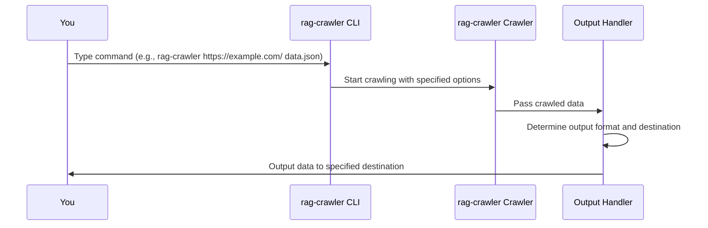

# Chapter 6: Output Handling
In the previous chapter, [Page Processing](05_page_processing.md), we explored how `rag-crawler` extracts relevant content from webpages. Now, let's dive into the concept of "Output Handling" and see how it delivers the crawled data to the desired destination.

## What is Output Handling?
Imagine you're a librarian, and you've cataloged all the books on a vast bookshelf. Now, you need to deliver these cataloged books to the library's storage room or share them with other libraries. Output Handling in `rag-crawler` works similarly, taking the crawled data and putting it where the user wants it.

## Why is Output Handling Important?
Let's consider a concrete example. Suppose you've crawled a website and extracted the relevant content. You might want to save this data to a file for later use or output it to the console for immediate inspection. Output Handling allows you to do just that.

## Key Concepts
Output Handling involves several key concepts:
1. `outPath`: The output path where the crawled data will be saved.
2. Output formats: The format in which the crawled data will be output, such as JSON or Markdown.

### outPath
The `outPath` is the destination where the crawled data will be saved. It can be a file path or a directory path.

### Output Formats
`rag-crawler` supports different output formats based on the `outPath`. If `outPath` is a file, the output will be in JSON format. If `outPath` is a directory, the output will be in Markdown format, with each page saved as a separate file.

## Using Output Handling
To use Output Handling, you simply need to specify the `outPath` when running `rag-crawler`. For example:
```bash
rag-crawler https://example.com/ data.json
```
This command saves the crawled data to a file named `data.json` in JSON format.

If you want to output the data to a directory, you can do so by specifying a directory path:
```bash
rag-crawler https://example.com/ pages/
```
This command saves each page as a separate Markdown file in the `pages/` directory.

## Internal Implementation
When you run a command with `rag-crawler`, the following sequence occurs:

The CLI takes your command, processes it, and then instructs the Crawler to start crawling. The Crawler passes the crawled data to the Output Handler, which determines the output format and destination based on the `outPath`.

The Output Handling logic is implemented in the `main` function in `src/bin.ts`. Here's a simplified example:
```javascript
if (outPath) {
  if (/(\/|\\)$/.test(outPath) || isDir(outPath)) {
    for (const page of pages) {
      let filePath = page.path.replace(/(\/|\.html)$/, "");
      filePath = path.join(outPath, new URL(filePath).pathname + ".md");
      mkdirSync(path.dirname(filePath), { recursive: true });
      writeFileSync(filePath, page.text);
    }
  } else {
    mkdirSync(path.dirname(outPath), { recursive: true });
    writeFileSync(outPath, JSON.stringify(pages, null, 2));
  }
} else {
  console.log(JSON.stringify(pages, null, 2));
}
```
This code checks if `outPath` is specified. If it is, it determines whether to output the data to a file or a directory. If `outPath` is not specified, it outputs the data to the console in JSON format.

## Conclusion
In this chapter, you've learned about Output Handling in `rag-crawler` and how it delivers the crawled data to the desired destination. You've seen how to use the `outPath` to specify the output destination and understood the internal implementation of Output Handling. In the next chapter, [GitHub Tree Crawler](07_github_tree_crawler.md), we'll explore how `rag-crawler` crawls GitHub tree structures.

---

Generated by [AI Codebase Knowledge Builder](https://github.com/The-Pocket/Tutorial-Codebase-Knowledge)