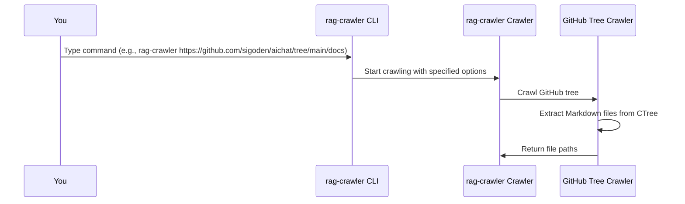

# Chapter 7: GitHub Tree Crawler
In the previous chapter, [Output Handling](06_output_handling.md), we explored how `rag-crawler` delivers the crawled data to the desired destination. Now, let's dive into the concept of "GitHub Tree Crawler" and see how it crawls GitHub repositories.

## What is a GitHub Tree Crawler?
Imagine you're a researcher trying to gather all the Markdown files from a specific branch of a GitHub repository. You could manually navigate through the repository, but that would be time-consuming. A GitHub Tree Crawler automates this process, extracting the relevant files from the repository.

## Why Use a GitHub Tree Crawler?
Let's consider a concrete example. Suppose you want to crawl a GitHub repository to generate a knowledge base. You need to extract Markdown files from a specific branch. The GitHub Tree Crawler is designed to solve this problem.

## Key Concepts
The GitHub Tree Crawler involves several key concepts:
1. `startUrl`: The URL of the GitHub repository tree.
2. `branch`: The branch of the repository to crawl.
3. `path filtering`: Filtering files based on their paths.

### startUrl
The `startUrl` is the URL of the GitHub repository tree. For example, `https://github.com/sigoden/aichat/tree/main/docs`.

### branch
The `branch` is the branch of the repository to crawl. In the `startUrl` example above, the branch is `main`.

### path filtering
The GitHub Tree Crawler filters files based on their paths. It extracts Markdown files (`.md` or `.MD` extension) and excludes files that match the `exclude` list.

## How to Use the GitHub Tree Crawler
To use the GitHub Tree Crawler, you simply need to provide the `startUrl` of the GitHub repository tree. For example:
```bash
rag-crawler https://github.com/sigoden/aichat/tree/main/docs
```
This command crawls the `main` branch of the `aichat` repository and extracts Markdown files under the `docs` directory.

## Internal Implementation
When you run a command with `rag-crawler` on a GitHub repository, the following sequence occurs:

The CLI takes your command, processes it, and then instructs the Crawler to start crawling. The Crawler uses the GitHub Tree Crawler to extract Markdown files from the specified branch.

The GitHub Tree Crawler is implemented in the `crawlGHTree` function in `src/index.ts`. Here's a simplified example:
```javascript
async function crawlGHTree(startUrl: URL, exclude: string[]) {
  // ...
  const octokit = new Octokit({
    auth: undefined,
  });

  let [_, owner, repo, _scope, branch, ...parts] = startUrl.pathname.split("/");
  const rootPath = parts.join("/");

  const tree = await octokit.request(
    "GET /repos/{owner}/{repo}/git/trees/{tree_sha}",
    {
      owner,
      repo,
      tree_sha: branch,
      headers: {
        "X-GitHub-Api-Version": "2022-11-28",
      },
      recursive: "true",
    },
  );

  const paths = tree.data.tree
    .filter(
      (file) =>
        file.type === "blob" &&
        (file.path?.endsWith(".md") || file.path?.endsWith(".MD")) &&
        file.path.startsWith(rootPath) &&
        !shouldExcludeLink(file.path, exclude),
    )
    .map(
      (file) =>
        `https://raw.githubusercontent.com/${owner}/${repo}/${branch}/${file.path}`,
    );

  return paths;
}
```
This code uses the `Octokit` library to fetch the Git tree from the GitHub API. It then filters the files based on their paths and returns the URLs of the Markdown files.

## Understanding the GitHub Tree Crawler
The GitHub Tree Crawler uses the GitHub API to fetch the file tree of the specified repository and branch. It then filters the files to extract Markdown files.

## Conclusion
In this chapter, you've learned about the GitHub Tree Crawler and how it extracts Markdown files from a GitHub repository. You've seen how to use it to crawl a GitHub repository and understood the internal implementation. In the next chapter, [Logging and Error Handling](08_logging_and_error_handling.md), we'll explore how `rag-crawler` handles logging and errors.

---

Generated by [AI Codebase Knowledge Builder](https://github.com/The-Pocket/Tutorial-Codebase-Knowledge)