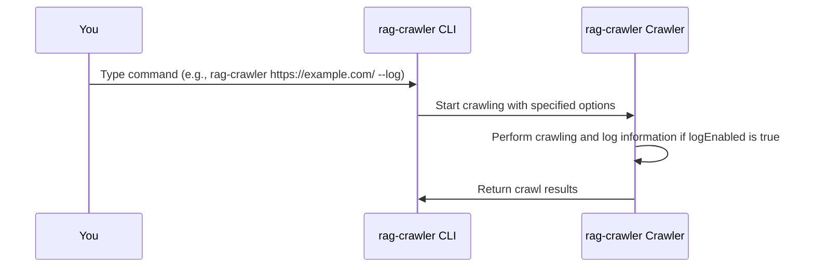

# Chapter 8: Logging and Error Handling
In the previous chapter, [GitHub Tree Crawler](07_github_tree_crawler.md), we explored how `rag-crawler` crawls GitHub repositories. Now, let's dive into the concept of "Logging and Error Handling" and see how it helps you understand what's happening during the crawling process and handle any issues that may arise.

## What is Logging and Error Handling?
Imagine you're on a road trip, and you want to know the current status of your journey, such as the distance traveled and any obstacles encountered. Logging and Error Handling in `rag-crawler` works similarly, providing you with information about the crawling process and alerting you to any errors that occur.

## Why is Logging and Error Handling Important?
Let's consider a concrete example. Suppose you're crawling a large website, and you want to monitor the progress and be notified if any errors occur. Logging and Error Handling allows you to do just that.

## Key Concepts
Logging and Error Handling involves several key concepts:
1. `logEnabled`: A flag that controls whether logging is enabled during the crawling process.
2. Error handling: The mechanism for handling errors that occur during crawling.

### logEnabled
The `logEnabled` flag determines whether `rag-crawler` logs information during the crawling process. When `logEnabled` is `true`, `rag-crawler` outputs log messages to the console.

```javascript
{
  logEnabled: true,
}
```
This tells `rag-crawler` to log information during the crawling process.

### Error Handling
`rag-crawler` handles errors that occur during crawling using a try-catch block. If an error occurs and `breakOnError` is `true`, the crawling process is terminated. Otherwise, the error is logged to the console.

```javascript
try {
  // crawling code
} catch (err) {
  if (options.breakOnError) {
    throw err;
  } else if (options.logEnabled) {
    console.error(err);
  }
}
```
This code catches any errors that occur during crawling and handles them based on the `breakOnError` and `logEnabled` flags.

## Using Logging and Error Handling
To use Logging and Error Handling, you can specify the `--log` or `--no-log` option when running `rag-crawler`. For example:
```bash
rag-crawler https://example.com/ --log
```
This command enables logging during the crawling process.

You can also disable logging using the `--no-log` option:
```bash
rag-crawler https://example.com/ --no-log
```
This command disables logging during the crawling process.

## Internal Implementation
When you run a command with `rag-crawler`, the following sequence occurs:

The CLI takes your command, processes it, and then instructs the Crawler to start crawling. The Crawler performs the crawling and logs information if `logEnabled` is `true`.

The Logging and Error Handling logic is implemented in the `crawlWebsite` function in `src/index.ts`. Here's a simplified example:
```javascript
export async function* crawlWebsite(
  startUrl: string,
  options: Partial<CrawlOptions>,
) {
  // ...
  if (options.logEnabled) {
    console.log(`⚙️  maxConnections=${options.maxConnections}`);
  }
  // ...
  try {
    // crawling code
  } catch (err) {
    if (options.breakOnError) {
      throw err;
    } else if (options.logEnabled) {
      console.error(err);
    }
  }
  // ...
}
```
This code logs information during the crawling process if `logEnabled` is `true` and handles errors based on the `breakOnError` and `logEnabled` flags.

## Conclusion
In this chapter, you've learned about Logging and Error Handling in `rag-crawler` and how it helps you understand what's happening during the crawling process and handle any issues that may arise. You've seen how to use the `--log` and `--no-log` options to control logging and understood the internal implementation of Logging and Error Handling. This concludes the `rag-crawler` tutorial. We hope you've gained a good understanding of how to use `rag-crawler` to crawl websites and GitHub repositories.

---

Generated by [AI Codebase Knowledge Builder](https://github.com/The-Pocket/Tutorial-Codebase-Knowledge)