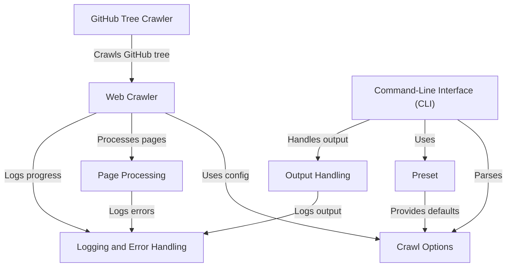

# Tutorial: rag-crawler

**RAG Crawler** is a tool that *crawls websites* and *extracts relevant content* to generate knowledge files for RAG (Retrieval-Augmented Generation). 
It allows users to **customize the crawling process** using various options and presets, making it adaptable to different websites and use cases.
The crawler can handle different types of content, including HTML pages and Markdown files on GitHub repositories.

**Source Repository:** [https://github.com/sigoden/rag-crawler](https://github.com/sigoden/rag-crawler)

## Chapters

1. [Command-Line Interface (CLI)](01_command_line_interface__cli_.md)
2. [Preset](02_preset.md)
3. [Crawl Options](03_crawl_options.md)
4. [Web Crawler](04_web_crawler.md)
5. [Page Processing](05_page_processing.md)
6. [Output Handling](06_output_handling.md)
7. [GitHub Tree Crawler](07_github_tree_crawler.md)
8. [Logging and Error Handling](08_logging_and_error_handling.md)

---

Generated by [AI Codebase Knowledge Builder](https://github.com/The-Pocket/Tutorial-Codebase-Knowledge)